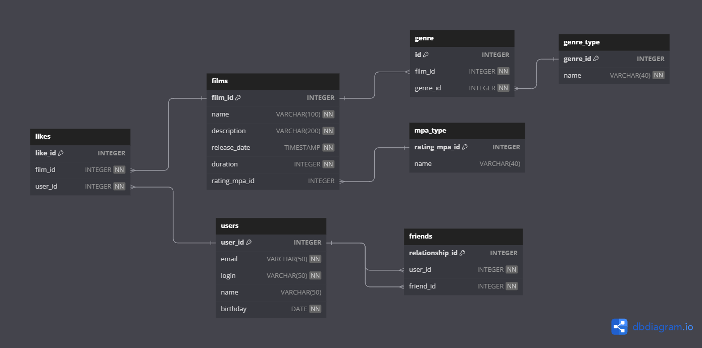

# Filmorate
Учебный проект, представляющий из себя бэкенд для сервиса, который на основании предпочтений пользователя и оценок его друзей предложит топ фильмов для просмотра.

## Проект был реализован в течение 3 спринтов:
1. Реализация моделей film и user, хранения в памяти приложения, аннотаций, валидации,  кастомной валидации, логирования, тестов на валидацию. Вся логика  - в контроллерах.  
**Стек: Java 11, Spring Boot, Maven, REST, Lombok, Postman.**
2. Совершенствование архитектуры - вынесение хранения и бизес-логики в отдельные слои. Внедрение зависимостей. Реализация моделей likes и добавления в друзья. Работа с Optional, переменными пути, параметрами запроса. Создание ExceptionHandler.  
3. Реализация моделей genre и rating, хранения в БД, DAO и мапперов, CRUD-операций с использованием JdbcTemplate, интеграционное тестирование.  
**Стек: БД H2, JdbcTemplate, Junit5.**

## 4 спринт: Групповой проект в команде 4 человек по [ссылке](https://github.com/olgamatrakhova/java-filmorate)
В ходе работы были отточены навыки командной работы над проектом:  
анализ и планирование, проектирование, разработка, ревью, тестирование и стабилизация, отладка и передача заказчику, презентация, выступление.  
Реализованы такие функциональности, как отзывы, поиск, общие фильмы, рекомендации, лента событий, популярные фильмы, фильмы по режиссёрам, удаление фильмов и пользователей.
Стек: Notion, канбан, zoom, telegram

## Модель базы данных

## Планы по доработке проекта:
Перенести всю функциональность группового проекта в свой проект  
Покрыть проект тестами

## Основные запросы

~~~~sql
SELECT *
FROM film
~~~~
- Выборка одного фильма с id 1
~~~~sql
SELECT *
FROM film
WHERE id = 1
~~~~
- Выборка всех пользователей
~~~~sql
SELECT *
FROM user
~~~~
- Выборка одного пользователя с id = 1
~~~~sql
SELECT *
FROM user
WHERE id = 1
~~~~

- Запрос на получение топ 10 популярных фильмов
~~~~sql
SELECT *
FROM film
WHERE film_id IN (
  SELECT
    film_id,
    count(user_id) AS likes_count
  FROM like
  GROUP BY film_id
  ORDER BY likes_count DESC
  LIMIT (10));
~~~~
